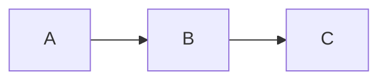

# Mixed features

Text with :sparkles: emoji, math $a^2+b^2=c^2$, and a [link](https://x.com).

| feature | ok |
|---|:---:|
| table | :white_check_mark: |
| math  | $\pi$ |

> [!NOTE]
> A note containing `code` and **bold**.

