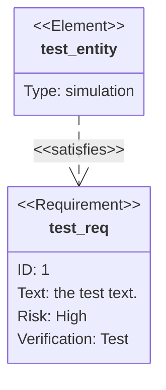

# accessibility #8

```mermaid
requirementDiagram
      accTitle: My Requirement Diagram
      accDescr: My Requirement Diagram Description

       requirement test_req {
  id: 1
  text: the test text.
  risk: high
  verifymethod: test
  }

  element test_entity {
  type: simulation
  }

  test_entity - satisfies -> test_req
```
