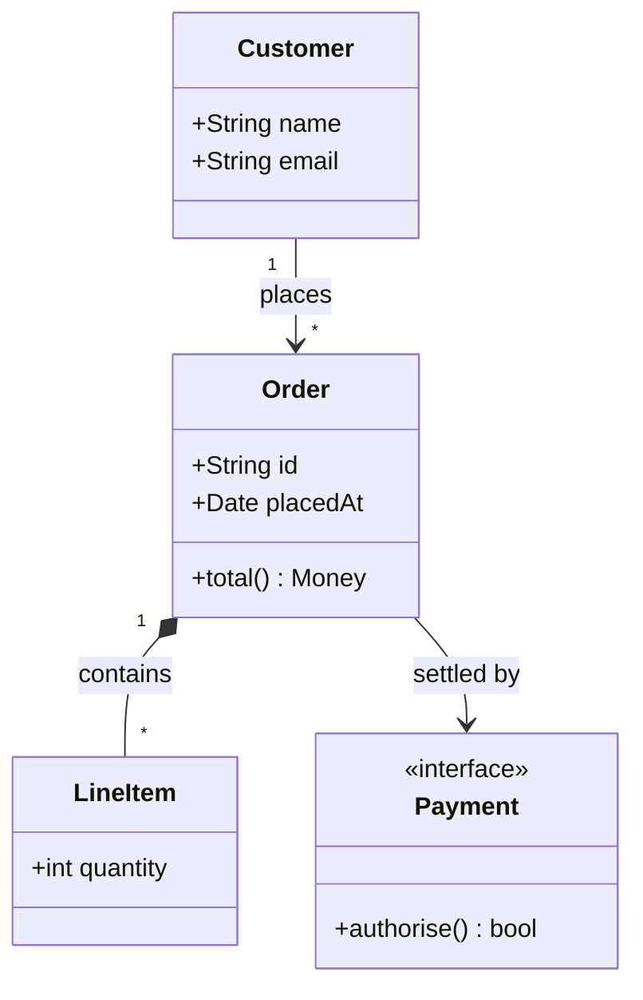

# classDiagram #3

```mermaid
---
config:
  theme: default
  look: classic
  layout: dagre
---
classDiagram
  class Customer {
    +String name
    +String email
  }
  class Order {
    +String id
    +Date placedAt
    +total() Money
  }
  class LineItem {
    +int quantity
  }
  class Payment {
    <<interface>>
    +authorise() bool
  }
  Customer "1" --> "*" Order : places
  Order "1" *-- "*" LineItem : contains
  Order --> Payment : settled by
```
