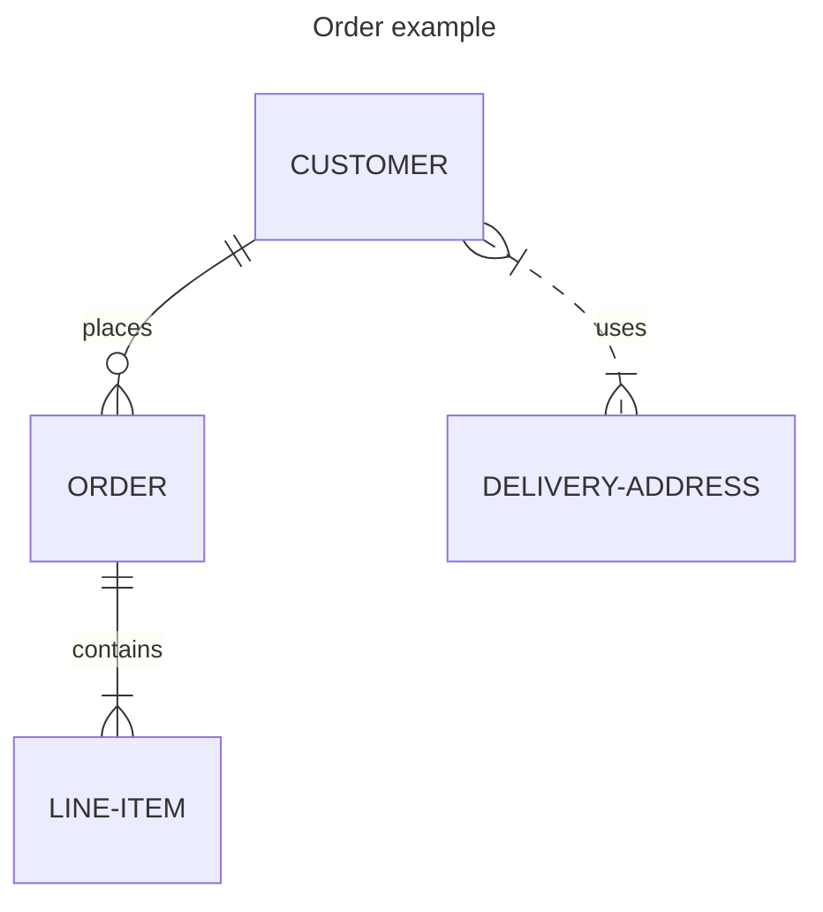

# entityRelationshipDiagram #25

```mermaid
---
title: Order example
config:
    layout: dagre
---
erDiagram
    CUSTOMER ||--o{ ORDER : places
    ORDER ||--|{ LINE-ITEM : contains
    CUSTOMER }|..|{ DELIVERY-ADDRESS : uses
```
