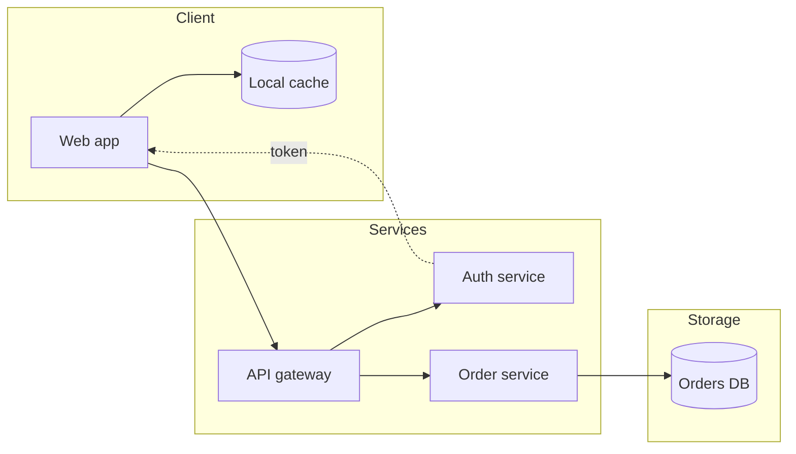

# flowchart #8

```mermaid
---
config:
  theme: default
  look: classic
  layout: dagre
---
flowchart LR
  subgraph Client
    UI[Web app]
    Cache[(Local cache)]
  end
  subgraph Services
    API[API gateway]
    Auth[Auth service]
    Orders[Order service]
  end
  subgraph Storage
    DB[(Orders DB)]
  end
  UI --> API
  UI --> Cache
  API --> Auth
  API --> Orders
  Orders --> DB
  Auth -. token .-> UI
```
