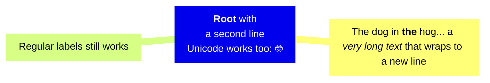

# mindmap #13

```mermaid
mindmap
    id1["`**Root** with
a second line
Unicode works too: 🤓`"]
      id2["`The dog in **the** hog... a *very long text* that wraps to a new line`"]
      id3[Regular labels still works]
```
