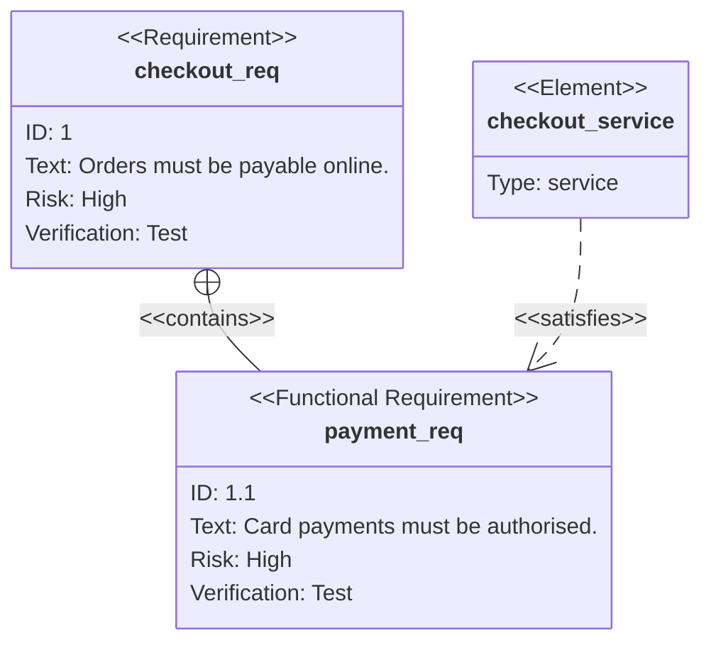

# requirementDiagram #2

```mermaid
requirementDiagram
  requirement checkout_req {
    id: 1
    text: Orders must be payable online.
    risk: high
    verifymethod: test
  }
  functionalRequirement payment_req {
    id: 1.1
    text: Card payments must be authorised.
    risk: high
    verifymethod: test
  }
  element checkout_service {
    type: service
  }
  checkout_req - contains -> payment_req
  checkout_service - satisfies -> payment_req
```
