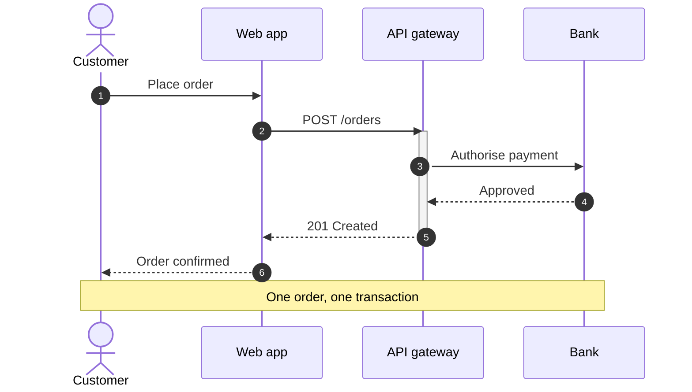

# sequenceDiagram #2

```mermaid
sequenceDiagram
  autonumber
  actor Customer
  participant Web as Web app
  participant API as API gateway
  participant Bank
  Customer->>Web: Place order
  Web->>API: POST /orders
  activate API
  API->>Bank: Authorise payment
  Bank-->>API: Approved
  API-->>Web: 201 Created
  deactivate API
  Web-->>Customer: Order confirmed
  Note over Customer,Bank: One order, one transaction
```
