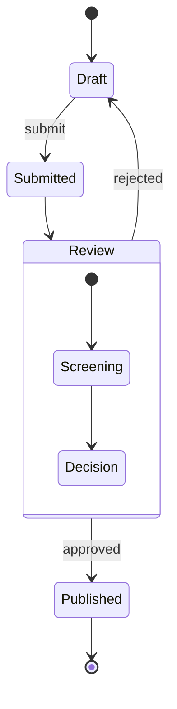

# stateDiagram #4

```mermaid
---
config:
  theme: default
  look: classic
  layout: dagre
---
stateDiagram-v2
  [*] --> Draft
  Draft --> Submitted : submit
  state Review {
    [*] --> Screening
    Screening --> Decision
  }
  Submitted --> Review
  Review --> Published : approved
  Review --> Draft : rejected
  Published --> [*]
```
