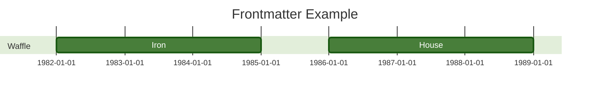

# syntax-reference #2

```mermaid
---
title: Frontmatter Example
displayMode: compact
config:
  theme: forest
gantt:
    useWidth: 400
    compact: true
---
gantt
    section Waffle
        Iron  : 1982, 3y
        House : 1986, 3y
```
