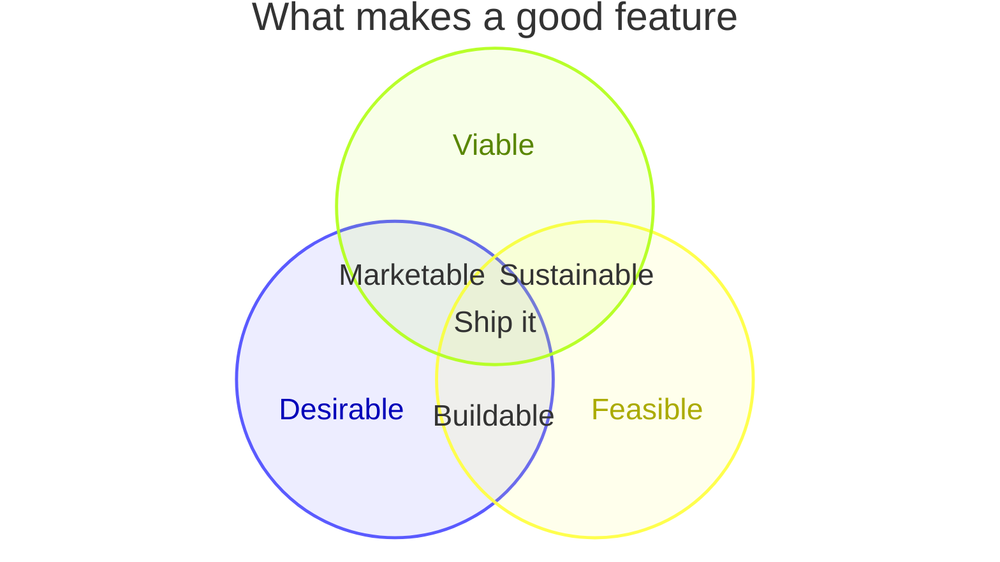

# venn #2

```mermaid
---
config:
  theme: default
  look: classic
---
venn-beta
  title What makes a good feature
  set Desirable
  set Feasible
  set Viable
  union Desirable,Feasible["Buildable"]
  union Feasible,Viable["Sustainable"]
  union Desirable,Viable["Marketable"]
  union Desirable,Feasible,Viable["Ship it"]
```
